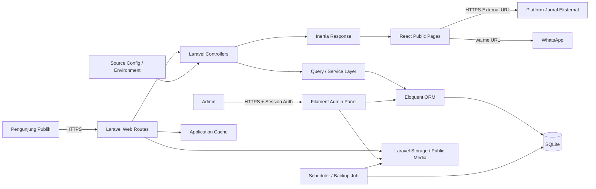
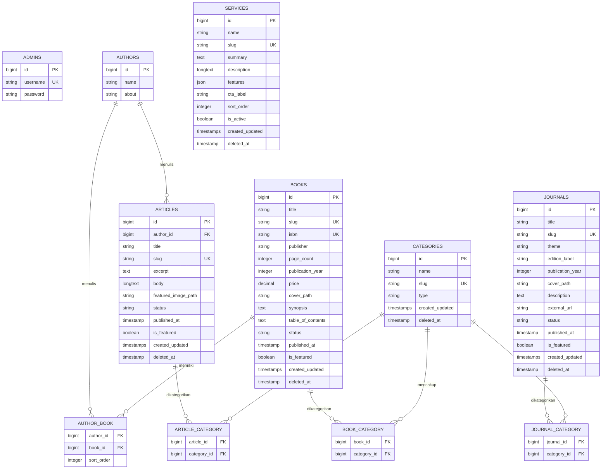
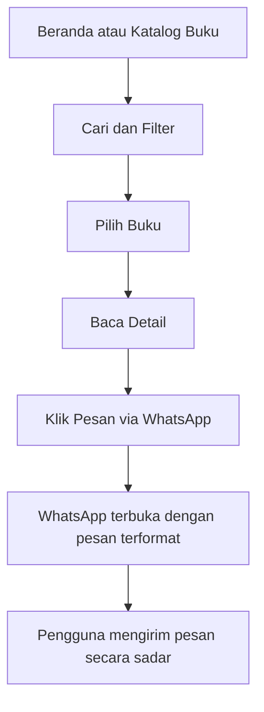
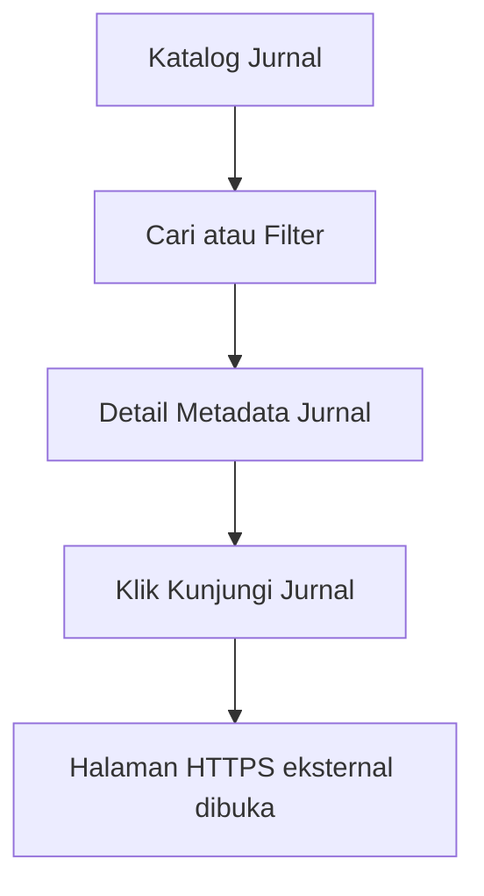
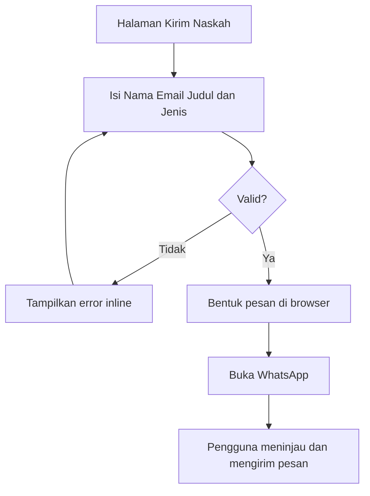

# Product Requirements Document (PRD)

## Taretan Media

| Atribut | Nilai |
|---|---|
| Produk | Taretan Media |
| Tipe | Web app penerbit buku dan publikasi ilmiah |
| Versi PRD | 1.0 |
| Status | Siap untuk perencanaan implementasi |
| Bahasa produk | Bahasa Indonesia |
| Tech stack | Laravel, Inertia.js, React.js, Filament, SQLite |
| Sasaran rilis | MVP production-ready [📌 ASSUMED] |

> **Keputusan tervalidasi:** jurnal pada versi awal berupa katalog metadata yang mengarahkan pengguna ke halaman eksternal; tujuan bisnis penjualan buku, lead jasa penerbitan, dan reputasi publikasi diprioritaskan secara seimbang; layanan menampilkan satu harga tetap dan menggunakan CTA konsultasi; arah visual menggabungkan karakter akademis-formal dengan tampilan modern.

### Register Asumsi Terkonfirmasi

Asumsi awal AS-01 sampai AS-10 dikonfirmasi pengguna pada 4 September 2026. AS-05 kemudian diperbarui oleh keputusan Q9-C, sehingga versi pada register ini menjadi acuan terbaru. Penanda asumsi inline tetap dipertahankan untuk traceability historis.

| ID | Asumsi yang dikonfirmasi | Status |
|---|---|---|
| AS-01 | Website berfungsi sebagai katalog, media informasi, dan lead generation, bukan marketplace dengan checkout internal. | ✅ Terkonfirmasi |
| AS-02 | Pengunjung publik bukan role autentikasi dan tidak disimpan sebagai akun. | ✅ Terkonfirmasi |
| AS-03 | MVP menggunakan satu akun admin, dengan struktur autentikasi yang tetap dapat dikembangkan jika kelak diperlukan. | ✅ Terkonfirmasi |
| AS-04 | Buku, jurnal, dan artikel menggunakan status draft dan published. | ✅ Terkonfirmasi |
| AS-05 | Layanan tetap dikelola admin. Profil, kontak, nomor WhatsApp, media sosial, template pesan, dan SEO global ditetapkan melalui source code atau environment sesuai Q9-C. | ✅ Diperbarui oleh Q9-C |
| AS-06 | File media disimpan melalui Laravel Storage, sedangkan SQLite hanya menyimpan path dan metadata. | ✅ Terkonfirmasi |
| AS-07 | Author menjadi entitas terpisah dan mendukung relasi multiple authors pada buku. | ✅ Terkonfirmasi |
| AS-08 | Kategori dikelola admin dan dapat digunakan sesuai tipe publikasinya. | ✅ Terkonfirmasi |
| AS-09 | Katalog buku mendukung filter kategori, rentang harga, tahun terbit, serta pencarian judul atau penulis. | ✅ Terkonfirmasi |
| AS-10 | Artikel mendukung rich text yang disanitasi, slug SEO, featured image, excerpt, dan tanggal publikasi. | ✅ Terkonfirmasi |

### Keputusan Kesiapan Implementasi

| ID | Keputusan terkonfirmasi | Dampak implementasi |
|---|---|---|
| Q6-B | Target deployment adalah shared hosting dan SQLite tetap digunakan jika hosting lulus preflight teknis. | Wajib tersedia PHP/Laravel yang kompatibel, ekstensi `pdo_sqlite`, filesystem persisten dengan file locking, direktori database writable di luar public web root, dukungan Composer/CLI untuk deployment, serta mekanisme backup terjadwal. |
| Q7-A | Buku, jurnal, dan artikel masing-masing dapat memiliki banyak kategori. | Ketiganya memakai pivot table many-to-many. |
| Q8-A | Akun admin pertama dibuat melalui database seeder dengan credential dari environment. | Seeder harus idempotent dan tidak boleh berisi password plaintext di repository. |
| Q9-C | Pengaturan global tetap disimpan pada source code atau environment, bukan tabel `SITE_SETTINGS`. | Profil/konten statis berada pada source/config; credential, nomor WhatsApp, email, URL sosial, dan nilai per-environment berada pada environment. Perubahannya memerlukan deployment atau akses konfigurasi hosting. |
| Q10-B | Konten awal belum tersedia sehingga development menggunakan seed/demo data. | Demo data hanya untuk local/staging dan tidak boleh terbawa sebagai konten production tanpa persetujuan. |

---

## 1. Executive Summary

Taretan Media adalah website publik untuk menampilkan katalog buku, katalog jurnal, artikel, profil penerbit, layanan, dan informasi kontak. Produk ditujukan kepada penulis, akademisi, peneliti, pendidik, praktisi, serta pembaca yang ingin menemukan terbitan dan layanan Taretan Media.

Website berfungsi sebagai katalog, kanal informasi, dan lead generation. Pemesanan buku, konsultasi layanan, serta pengiriman naskah dilanjutkan melalui WhatsApp. Produk tidak menyediakan akun pengunjung, keranjang, checkout, pembayaran, maupun penyimpanan data formulir pengunjung.

Admin mengelola data melalui panel privat berbasis Filament. Halaman publik dibangun dengan Laravel, Inertia.js, dan React.js. Data disimpan dalam SQLite serta dikirim ke halaman React melalui Inertia props tanpa REST API publik.

Keberhasilan MVP dinilai secara seimbang dari kemudahan menemukan publikasi, jumlah intent menuju WhatsApp atau jurnal eksternal, dan kemampuan admin memperbarui konten tanpa bantuan developer. Target awal pengukuran ditetapkan sebagai baseline operasional karena belum tersedia data trafik historis. [📌 ASSUMED]

---

## 2. Problem Statement

### 2.1 Permasalahan pengguna

1. Pembaca kesulitan menemukan katalog buku Taretan Media beserta metadata, harga, dan informasi pemesanannya dalam satu tempat.
2. Akademisi dan peneliti membutuhkan jalur yang jelas untuk menemukan jurnal lalu mengakses halaman publikasi eksternalnya.
3. Penulis membutuhkan informasi layanan penerbitan dan cara cepat mengonsultasikan atau mengirimkan rencana naskah.
4. Calon pelanggan membutuhkan bukti kredibilitas penerbit melalui profil, publikasi, artikel, alamat, dan kanal kontak resmi.

### 2.2 Permasalahan bisnis

1. Informasi buku, jurnal, artikel, dan layanan berpotensi tersebar atau sulit diperbarui.
2. Tim penerbit membutuhkan CMS sederhana yang dapat digunakan tanpa mengubah source code.
3. Taretan Media membutuhkan kanal digital yang mendukung tiga hasil secara seimbang: pemesanan buku, lead layanan penerbitan, dan reputasi publikasi ilmiah.
4. Website harus meminimalkan pengelolaan data pribadi dan kompleksitas transaksi dengan meneruskan komunikasi ke WhatsApp.

### 2.3 Peluang

Menyediakan satu sumber informasi resmi yang cepat, responsif, mudah ditemukan mesin pencari, dan mudah dikelola dapat meningkatkan kepercayaan terhadap merek serta memperpendek jalur pengguna dari discovery menuju komunikasi langsung. [📌 ASSUMED]

---

## 3. Goals & Success Metrics

### 3.1 Objective dan Key Results

**O1. Mempermudah pengguna menemukan publikasi yang relevan.**

- KR1: Minimal 90% peserta usability test dapat menemukan satu buku berdasarkan judul/kategori dalam maksimal 3 menit tanpa bantuan. [📌 ASSUMED]
- KR2: Minimal 90% peserta dapat membuka halaman jurnal eksternal dari halaman detail jurnal dalam maksimal 3 interaksi. [📌 ASSUMED]
- KR3: Tingkat pencarian/filter buku yang menghasilkan error aplikasi kurang dari 1% per bulan setelah analytics tersedia. [📌 ASSUMED]

**O2. Mengubah kunjungan menjadi intent bisnis yang terukur.**

- KR1: Minimal 5% sesi halaman detail buku menghasilkan klik CTA “Pesan via WhatsApp” dalam 90 hari pertama. [📌 ASSUMED]
- KR2: Minimal 3% sesi halaman layanan menghasilkan klik CTA konsultasi WhatsApp dalam 90 hari pertama. [📌 ASSUMED]
- KR3: Minimal 60% pengguna yang mulai mengisi form kirim naskah berhasil membuka WhatsApp dengan pesan terformat. [📌 ASSUMED]

**O3. Menyediakan CMS yang aman dan efisien.**

- KR1: Admin dapat membuat dan memublikasikan buku, jurnal, atau artikel dalam maksimal 10 menit pada acceptance test. [📌 ASSUMED]
- KR2: 100% route panel admin dan operasi mutasi memerlukan autentikasi serta CSRF protection.
- KR3: Tidak ada konten berstatus draft yang dapat diakses melalui route publik pada integration test.

**O4. Menyediakan pengalaman publik yang berkualitas.**

- KR1: Lighthouse mobile pada halaman utama, katalog, dan detail mencapai Performance ≥80, Accessibility ≥90, Best Practices ≥90, dan SEO ≥90 pada lingkungan produksi representatif. [📌 ASSUMED]
- KR2: Core Web Vitals p75 menargetkan LCP ≤2,5 detik, INP ≤200 ms, dan CLS ≤0,1 setelah data lapangan tersedia. [📌 ASSUMED]
- KR3: Availability bulanan minimal 99,5%, tidak termasuk pemeliharaan terjadwal. [📌 ASSUMED]

### 3.2 Event pengukuran

Analytics yang berorientasi privasi mencatat event agregat `book_view`, `book_filter`, `book_whatsapp_click`, `journal_external_click`, `service_whatsapp_click`, `manuscript_form_start`, `manuscript_whatsapp_click`, dan `share_click`, tanpa mengirim nama atau email formulir. [📌 ASSUMED]

---

## 4. User Personas

### P-01 Pembaca/Pembeli Buku

- **Tujuan:** menemukan buku, membaca detail, mengetahui harga, lalu memesan.
- **Kebutuhan:** pencarian cepat, filter, informasi lengkap, CTA WhatsApp yang jelas.
- **Hambatan:** katalog sulit ditelusuri dan jalur pemesanan tidak jelas.
- **Perangkat dominan:** smartphone. [📌 ASSUMED]

### P-02 Akademisi atau Peneliti

- **Tujuan:** menemukan metadata jurnal dan mengakses halaman publikasi resmi eksternal.
- **Kebutuhan:** tema, judul, edisi/periode, deskripsi, cover, dan external URL.
- **Hambatan:** ketidakjelasan sumber resmi atau tautan publikasi.

### P-03 Penulis atau Calon Klien

- **Tujuan:** memahami layanan dan berkonsultasi mengenai naskah.
- **Kebutuhan:** uraian layanan, profil kredibel, form singkat, dan komunikasi WhatsApp.
- **Hambatan:** tidak mengetahui proses atau kontak penerbit yang tepat.

### P-04 Pengunjung Pencari Kredibilitas

- **Tujuan:** menilai pengalaman, nilai, karya, serta keberadaan resmi penerbit.
- **Kebutuhan:** profil, visi-misi, artikel, publikasi, alamat, dan kanal sosial.

### P-05 Admin Konten

- **Tujuan:** menjaga data publik tetap benar dan mutakhir.
- **Kebutuhan:** login aman, CRUD sederhana, preview/status publikasi, validasi, dan pengelolaan media.
- **Hambatan:** ketergantungan kepada developer untuk perubahan konten.

---

## 5. User Stories

### US-01 Menelusuri katalog buku

**Given** pengunjung membuka katalog buku, **When** pengunjung mencari, memfilter, mengurutkan, atau berpindah halaman, **Then** sistem menampilkan buku published yang sesuai beserta state filter yang konsisten pada URL.

**Acceptance criteria:**
1. Hanya buku published yang tampil.
2. Pencarian mendukung judul, ISBN, penerbit, dan nama penulis. [📌 ASSUMED]
3. Filter mendukung kategori, rentang harga, dan tahun terbit. [📌 ASSUMED]
4. Hasil kosong menampilkan pesan serta aksi reset filter.
5. Query invalid ditangani tanpa server error.

### US-02 Melihat detail buku

**Given** buku berstatus published, **When** pengunjung membuka slug buku, **Then** sistem menampilkan metadata buku, nama dan bio singkat penulis, cover, harga, sinopsis, daftar isi, CTA pesan, dan aksi berbagi yang tersedia.

**Acceptance criteria:**
1. Multiple authors ditampilkan berurutan.
2. Harga ditampilkan dalam format Rupiah.
3. Field opsional yang kosong tidak menghasilkan label kosong.
4. Slug draft, terhapus, atau tidak valid menghasilkan 404.

### US-03 Memesan buku melalui WhatsApp

**Given** pengunjung berada pada detail buku, **When** CTA pesan dipilih, **Then** WhatsApp dibuka menuju nomor resmi dengan pesan yang memuat judul dan URL buku.

**Acceptance criteria:**
1. Nomor tujuan berasal dari konfigurasi aktif.
2. Isi pesan URL-encoded dan tidak rusak oleh karakter khusus.
3. Jika WhatsApp native tidak tersedia, tautan tetap dapat dibuka melalui WhatsApp Web.
4. Klik CTA menghasilkan event analytics agregat. [📌 ASSUMED]

### US-04 Membagikan buku

**Given** pengunjung berada pada detail buku, **When** memilih aksi bagikan, **Then** sistem menggunakan Web Share API atau fallback salin tautan.

**Acceptance criteria:**
1. URL kanonis buku dibagikan.
2. Fallback memberikan feedback “Tautan disalin”.
3. Metadata Open Graph tersedia untuk preview platform sosial. [📌 ASSUMED]

### US-05 Menelusuri dan membuka jurnal

**Given** pengunjung membuka katalog jurnal, **When** memilih jurnal published, **Then** sistem menampilkan metadata lengkap dan CTA menuju halaman jurnal eksternal.

**Acceptance criteria:**
1. Katalog mendukung pencarian tema/judul dan filter tahun. [📌 ASSUMED]
2. Detail jurnal menampilkan judul, tema, deskripsi, cover, periode/edisi bila tersedia, dan external URL.
3. External URL hanya menerima skema HTTPS. [📌 ASSUMED]
4. Tautan eksternal dibuka aman dengan `noopener noreferrer`.

### US-06 Membaca artikel

**Given** artikel berstatus published, **When** pengunjung membuka daftar atau detail artikel, **Then** sistem menampilkan konten artikel yang aman, mudah dibaca, dan dapat dibagikan.

**Acceptance criteria:**
1. Daftar mendukung kategori, pencarian, dan pagination. [📌 ASSUMED]
2. Detail memuat judul, penulis, satu atau beberapa kategori, tanggal, featured image, dan isi.
3. Rich text disanitasi sebelum ditampilkan.
4. Artikel draft menghasilkan 404 pada route publik.

### US-07 Mengirim informasi naskah ke WhatsApp

**Given** pengunjung membuka halaman Kirim Naskah, **When** nama, email, judul naskah, dan jenis publikasi valid lalu tombol kirim dipilih, **Then** WhatsApp dibuka dengan pesan terformat tanpa menyimpan data formulir ke server.

**Acceptance criteria:**
1. Semua field wajib dan mempunyai validasi sisi klien.
2. Email divalidasi formatnya.
3. Tombol tidak meneruskan data sebelum form valid.
4. Data tidak dikirim ke database, log server, atau analytics.
5. Halaman menjelaskan bahwa WhatsApp akan memproses data sesuai kebijakannya. [📌 ASSUMED]

### US-08 Memahami profil dan layanan

**Given** pengunjung membutuhkan informasi penerbit, **When** membuka profil atau layanan, **Then** sistem menampilkan informasi terbaru, harga layanan, dan CTA konsultasi.

**Acceptance criteria:**
1. Profil memuat ringkasan, visi, misi, dan nilai.
2. Layanan memuat nama, harga tetap, deskripsi, cakupan/fitur, urutan, dan CTA konsultasi.
3. CTA WhatsApp menyertakan nama layanan yang dipilih.
4. Harga layanan ditampilkan dalam format Rupiah; nilai kosong ditampilkan sebagai Rp 0.

### US-09 Menghubungi penerbit

**Given** pengunjung membuka halaman kontak, **When** memilih kanal komunikasi, **Then** sistem membuka WhatsApp, email, Instagram, atau peta/alamat yang sesuai.

**Acceptance criteria:**
1. Hanya kanal yang dikonfigurasi yang tampil.
2. Email menggunakan tautan `mailto:` dan telepon/WhatsApp menggunakan format valid.
3. Alamat tetap tersedia sebagai teks meskipun tautan peta tidak diisi.

### US-10 Admin masuk dan keluar

**Given** admin memiliki kredensial valid, **When** login berhasil, **Then** admin memperoleh session terautentikasi dan dapat membuka dashboard Filament.

**Acceptance criteria:**
1. Kredensial invalid tidak mengungkap apakah username terdaftar.
2. Login dibatasi maksimal 5 kegagalan per menit per kombinasi identitas dan IP. [📌 ASSUMED]
3. Session ID diregenerasi setelah login.
4. Logout menginvalidasi session dan CSRF token terkait.
5. Pengunjung anonim tidak dapat mengakses panel admin.

### US-11 Admin mengelola konten

**Given** admin telah login, **When** membuat, mengubah, memublikasikan, mengarsipkan, atau menghapus konten, **Then** perubahan tervalidasi dan tercermin pada halaman publik sesuai statusnya.

**Acceptance criteria:**
1. CRUD tersedia untuk buku, penulis, kategori, jurnal, artikel, dan layanan.
2. Slug unik dapat dibuat otomatis dan diedit.
3. Relasi tidak valid ditolak.
4. Draft tidak tampil publik.
5. Penghapusan konten utama memakai soft delete dan dapat dipulihkan. [📌 ASSUMED]

### US-12 Admin mengelola media dan external URL

**Given** admin mengedit konten, **When** mengunggah gambar atau mengisi external URL, **Then** sistem memvalidasi file/URL dan menyimpan referensi yang aman.

**Acceptance criteria:**
1. Gambar menerima JPEG, PNG, atau WebP maksimal 5 MB. [📌 ASSUMED]
2. Nama file dibuat ulang oleh sistem.
3. SVG dan file executable ditolak. [📌 ASSUMED]
4. URL jurnal wajib HTTPS dan valid.
5. File yang gagal tidak meninggalkan record konten setengah jadi.

---

## 6. Functional Requirements

### 6.1 Must Have

| ID | Requirement | Traceability |
|---|---|---|
| FR-M01 | Sistem menyediakan halaman Beranda, Katalog Buku, Detail Buku, Jurnal, Detail Jurnal, Artikel, Detail Artikel, Kirim Naskah, Profil, Layanan, dan Kontak. | US-01 s.d. US-09 |
| FR-M02 | Katalog buku menyediakan pencarian, kategori, rentang harga, tahun, sorting, dan pagination berbasis query string. [📌 ASSUMED] | US-01 |
| FR-M03 | Buku menyimpan judul, slug, ISBN, penerbit, tahun, halaman, harga, cover, kategori, relasi multiple authors beserta nama dan bio singkat penulis, sinopsis, daftar isi, status, dan tanggal publikasi. | US-02 |
| FR-M04 | CTA pemesanan buku membentuk deep link WhatsApp dari template pesan dan konfigurasi nomor aktif. | US-03 |
| FR-M05 | Detail buku mendukung berbagi melalui native share atau salin tautan. | US-04 |
| FR-M06 | Jurnal menyimpan metadata serta external URL dan tidak menyimpan artikel ilmiah/PDF internal pada MVP. | US-05 |
| FR-M07 | Artikel menyediakan katalog, detail rich text, relasi many-to-many kategori, penulis, tanggal publikasi, dan status publikasi. | US-06 |
| FR-M08 | Form Kirim Naskah memvalidasi nama lengkap, email, judul naskah, dan jenis publikasi lalu membuat pesan WhatsApp tanpa persistensi server. | US-07 |
| FR-M09 | Layanan ditampilkan dengan satu harga tetap dan setiap layanan dapat diarahkan ke konsultasi WhatsApp. | US-08 |
| FR-M10 | Profil dan informasi global publik dibaca dari source/config; nomor WhatsApp, email, URL sosial, dan konfigurasi per-environment dibaca dari environment. Layanan tetap dapat diperbarui admin melalui Filament. | US-03, US-07, US-08, US-09 |
| FR-M11 | Panel Filament hanya dapat diakses admin terautentikasi melalui session. | US-10 |
| FR-M12 | Admin dapat melakukan CRUD dan mengelola status draft/published untuk seluruh konten dinamis. | US-11 |
| FR-M13 | Route publik hanya mengambil record published dan tidak terhapus. | US-01, US-02, US-05, US-06, US-11 |
| FR-M14 | Sistem memvalidasi upload media dan external URL. | US-12 |
| FR-M15 | Semua halaman mempunyai title, meta description, canonical URL, dan Open Graph minimum. [📌 ASSUMED] | US-02, US-04, US-05, US-06 |

### 6.2 Should Have

| ID | Requirement | Traceability |
|---|---|---|
| FR-S01 | Beranda menampilkan hero, publikasi unggulan, layanan, artikel terbaru, dan CTA kirim naskah. [📌 ASSUMED] | US-01, US-05, US-08 |
| FR-S02 | Admin dapat menandai buku, jurnal, artikel, dan layanan sebagai unggulan serta menentukan urutan. [📌 ASSUMED] | US-11 |
| FR-S03 | Sistem menyediakan sitemap XML, robots.txt, breadcrumb, dan structured data yang relevan. [📌 ASSUMED] | US-01, US-02, US-05, US-06 |
| FR-S04 | Sistem mencatat event conversion agregat tanpa data isi formulir. [📌 ASSUMED] | US-03, US-05, US-07, US-08 |
| FR-S05 | Soft delete dan restore tersedia untuk buku, jurnal, artikel, penulis, kategori, serta layanan. [📌 ASSUMED] | US-11 |
| FR-S06 | Admin dapat melihat preview konten sebelum publikasi. [📌 ASSUMED] | US-11 |

### 6.3 Could Have

| ID | Requirement | Traceability |
|---|---|---|
| FR-C01 | Related books dan related articles berdasarkan kategori. [📌 ASSUMED] | US-02, US-06 |
| FR-C02 | Impor/ekspor CSV untuk katalog buku dan jurnal. [📌 ASSUMED] | US-11 |
| FR-C03 | Penjadwalan tanggal publikasi konten. [📌 ASSUMED] | US-11 |
| FR-C04 | Optimasi gambar otomatis ke WebP dan responsive variants. [📌 ASSUMED] | US-12 |

### 6.4 Won't Have pada MVP

| ID | Requirement | Alasan |
|---|---|---|
| FR-W01 | Akun atau autentikasi pengunjung | Tidak dibutuhkan dan menghindari penyimpanan data pengguna. |
| FR-W02 | Keranjang, checkout, pembayaran, ongkir, dan inventori | Pemesanan dilakukan melalui WhatsApp. |
| FR-W03 | Penyimpanan submission naskah atau unggah file naskah | Form hanya membentuk pesan WhatsApp. |
| FR-W04 | Hosting PDF jurnal atau artikel ilmiah individual | Jurnal berupa metadata dan external URL. |
| FR-W05 | Kalkulator atau paket harga dinamis layanan | Revisi client hanya membutuhkan satu harga tetap per layanan. |
| FR-W06 | Komentar, rating, newsletter, dan notifikasi pengguna | Bukan kebutuhan inti MVP. [📌 ASSUMED] |
| FR-W07 | REST API publik atau aplikasi mobile native | Data publik dikirim melalui Inertia props. |

---

## 7. Non-Functional Requirements

### 7.1 Performance

- Halaman publik harus memenuhi target Core Web Vitals pada Bagian 3. [📌 ASSUMED]
- Query daftar wajib memakai pagination dan eager loading untuk relasi yang ditampilkan.
- Index database tersedia pada slug, status, published_at, category foreign key, year, dan kolom pencarian yang relevan. [📌 ASSUMED]
- Gambar publik memakai lazy loading di luar viewport, dimensi eksplisit, dan format teroptimasi. [📌 ASSUMED]
- Respons server p95 untuk halaman publik dinamis ditargetkan ≤500 ms pada beban normal, tidak termasuk aset pihak ketiga. [📌 ASSUMED]

### 7.2 Reliability dan operasional

- Shared hosting wajib lulus preflight: ekstensi `pdo_sqlite` aktif, file database berada pada filesystem persisten dan writable di luar public web root, file locking berfungsi, serta tersedia akses deployment dan backup. Jika salah satu syarat inti gagal, SQLite tidak boleh digunakan pada production dan database perlu dialihkan ke MySQL/PostgreSQL yang disediakan hosting.
- Availability target 99,5% per bulan. [📌 ASSUMED]
- Backup file SQLite dan media dilakukan harian, terenkripsi, dengan retensi 30 hari. [📌 ASSUMED]
- Restore backup diuji minimal setiap kuartal. [📌 ASSUMED]
- RPO ≤24 jam dan RTO ≤4 jam. [📌 ASSUMED]
- Deployment wajib menjalankan migration secara terkontrol dan membuat backup sebelum migration berisiko. [📌 ASSUMED]

### 7.3 Scalability

SQLite diterima untuk MVP pada shared hosting karena pola aplikasi read-heavy dan jumlah admin rendah, selama seluruh preflight pada Bagian 7.2 terpenuhi. Penulisan harus singkat; WAL hanya diaktifkan setelah pengujian kompatibilitas filesystem dan locking hosting. Database tidak boleh berada pada filesystem ephemeral atau direktori yang dapat diunduh publik. Migrasi ke database server dipicu bila terjadi lock berulang, hosting tidak mendukung backup/locking yang andal, atau beban tulis meningkat.

### 7.4 Accessibility

- Target WCAG 2.1 AA pada alur utama. [📌 ASSUMED]
- Semua fungsi dapat digunakan melalui keyboard.
- Focus indicator terlihat, label form terasosiasi, error tidak hanya dibedakan dengan warna, dan gambar bermakna memiliki alt text.
- Heading hierarchy, landmark, contrast, dan reduced motion diperiksa pada QA.

### 7.5 Compatibility

Mendukung dua versi mayor terbaru Chrome, Edge, Firefox, dan Safari serta viewport mobile mulai lebar 360 px. [📌 ASSUMED]

### 7.6 Maintainability

- Controller menangani orchestration, query kompleks ditempatkan pada query/service layer bila diperlukan, dan aturan validasi memakai Form Request atau mekanisme Filament.
- Route publik, policy admin, transformasi props, dan pembentukan WhatsApp URL mempunyai automated test.
- Konfigurasi environment dan prosedur deployment didokumentasikan. [📌 ASSUMED]

### 7.7 Privacy

- Tidak ada akun publik atau persistensi form kirim naskah.
- Log dan analytics tidak boleh berisi nama, email, isi pesan, credential, session token, atau query sensitif.
- Cookie non-esensial hanya aktif setelah consent jika analytics yang dipilih memerlukannya. [📌 ASSUMED]

---

## 8. System Architecture

### 8.1 Arsitektur logis



### 8.2 Komponen

1. **Laravel:** routing, controller, validasi server, Eloquent, session, security middleware, SEO response, dan operasi backend.
2. **Inertia.js:** mengirim page component dan props tanpa membangun REST API publik.
3. **React.js:** presentasi halaman publik, filter form, share fallback, validasi form kirim naskah, serta pembentukan/aktivasi CTA.
4. **Filament:** autentikasi dan resource CRUD admin.
5. **SQLite:** penyimpanan relational metadata aplikasi.
6. **Laravel Storage:** cover dan gambar konten. File tidak disimpan sebagai BLOB SQLite. [📌 ASSUMED]
7. **Integrasi eksternal:** WhatsApp deep link, halaman jurnal eksternal, Instagram, email, peta, dan analytics opsional.

### 8.3 Keputusan arsitektur

- Tidak ada REST API publik pada MVP. Kontrak pada Bagian 10 adalah kontrak HTTP page/action dan Inertia props.
- Server-side route tetap menjadi sumber kebenaran untuk filter, status publikasi, authorization, dan sanitasi.
- Form kirim naskah diproses lokal di browser. Konfigurasi nomor/template boleh diberikan sebagai props, tetapi nilai personal tidak dikirim balik ke aplikasi.
- SQLite ditempatkan sebagai file persisten dan writable di luar public web root pada shared hosting. Penggunaan production hanya diperbolehkan setelah `pdo_sqlite`, file locking, backup, dan proses deployment lolos preflight.

---

## 9. Data Model & ERD



### 9.1 Aturan data

- Entitas `ADMINS` hanya menyimpan `id` sebagai kunci teknis, `username` unik untuk identitas login, dan `password` yang telah di-hash. Nama, profil, `last_login_at`, timestamp, serta metadata admin lainnya tidak disimpan pada MVP karena tidak diperlukan untuk autentikasi.
- Session admin disimpan melalui session driver Laravel dan bukan sebagai atribut pada entitas `ADMINS`. Audit keamanan, bila diaktifkan, disimpan sebagai log terpisah dan tidak memperluas profil admin.
- Entitas `AUTHORS` menyimpan `id` sebagai kunci teknis, `name` sebagai nama penulis, dan `about` bertipe string sebagai bio singkat penulis. Field `about` boleh kosong dan dibatasi maksimal 255 karakter melalui validasi aplikasi serta `CHECK (length(about) <= 255)` pada SQLite agar batas tetap berlaku di tingkat database; slug, foto, path foto, timestamp, dan metadata penulis lainnya tidak disimpan pada MVP. [📌 ASSUMED]
- Foto author tetap tidak diunggah ke storage dan tidak direferensikan pada database. Tampilan author pada website menggunakan nama dan menampilkan `about` hanya apabila tersedia.
- Relasi many-to-many `AUTHOR_BOOK` tetap digunakan agar satu buku dapat memiliki beberapa penulis dan satu penulis dapat terhubung ke beberapa buku tanpa menduplikasi nama.
- Semua jenis publikasi memakai relasi kategori many-to-many: `BOOK_CATEGORY`, `JOURNAL_CATEGORY`, dan `ARTICLE_CATEGORY`. Kombinasi dua foreign key pada setiap pivot wajib unik agar kategori yang sama tidak terpasang dua kali pada publikasi yang sama.
- `type` kategori membatasi penggunaan ke `book`, `journal`, atau `article`; validasi server wajib menolak pemasangan kategori dengan tipe publikasi yang berbeda.
- Profil, visi, misi, nilai, alamat, dan teks global disimpan pada source/config. Nomor WhatsApp, email, URL sosial, serta nilai yang berbeda antar-environment berasal dari environment. Tidak ada tabel `SITE_SETTINGS` dan tidak ada menu pengaturan global pada Filament.
- Admin awal dibuat melalui seeder idempotent menggunakan `ADMIN_USERNAME` dan `ADMIN_PASSWORD` dari environment. Seeder melakukan hash password, menolak nilai kosong, dan tidak mencetak password ke log.
- Demo seed untuk buku, jurnal, artikel, author, kategori, dan layanan hanya dijalankan pada local/testing/staging. Production seeder tidak boleh memasukkan demo content.
- `status` menggunakan nilai `draft` dan `published`; `published_at` wajib saat published. [📌 ASSUMED]
- `price` buku tidak negatif dan disimpan sebagai decimal/integer nominal, bukan float.
- ISBN dinormalisasi dan unik jika diisi. Buku tanpa ISBN masih diperbolehkan untuk kompatibilitas katalog tertentu. [📌 ASSUMED]
- `external_url` jurnal wajib, valid, dan HTTPS.

---

## 10. API Contracts

> Produk tidak menyediakan REST API publik. Kontrak berikut mendefinisikan web route, request query/form, Inertia page/props, redirect, dan status code. Nama komponen dapat disesuaikan saat implementasi tanpa mengubah perilaku kontrak. [📌 ASSUMED]

### 10.1 Route publik

| Method | Path | Request | Response utama | Status |
|---|---|---|---|---|
| GET | `/` | Tidak ada | `Home/Index`: featured books, journals, articles, services, site summary | 200 |
| GET | `/buku` | `q`, `category`, `min_price`, `max_price`, `year`, `sort`, `page` | `Books/Index`: paginated books, filters, filter options | 200, 422 untuk query tak dapat dinormalisasi [📌 ASSUMED] |
| GET | `/buku/{slug}` | Slug | `Books/Show`: book, authors, categories, WhatsApp config publik, canonical URL | 200, 404 |
| GET | `/jurnal` | `q`, `category`, `year`, `page` | `Journals/Index`: paginated journal metadata | 200 |
| GET | `/jurnal/{slug}` | Slug | `Journals/Show`: journal metadata dan external URL | 200, 404 |
| GET | `/artikel` | `q`, `category`, `page` | `Articles/Index`: paginated article cards | 200 |
| GET | `/artikel/{slug}` | Slug | `Articles/Show`: sanitized article, author, categories, canonical URL | 200, 404 |
| GET | `/kirim-naskah` | Tidak ada | `Manuscripts/Create`: publication types, WhatsApp config publik, privacy notice | 200 |
| GET | `/profil` | Tidak ada | `Profile/Show`: about, vision, mission, values | 200 |
| GET | `/layanan` | Tidak ada | `Services/Index`: active services ordered, WhatsApp config publik | 200 |
| GET | `/kontak` | Tidak ada | `Contact/Show`: configured contact channels and address | 200 |
| GET | `/sitemap.xml` | Tidak ada | XML URL published | 200 |
| GET | `/robots.txt` | Tidak ada | Text directives | 200 |

**Contoh props `Books/Index`:**

```json
{
  "books": {
    "data": [{
      "title": "Judul Buku",
      "slug": "judul-buku",
      "coverUrl": "/storage/books/cover.webp",
      "authors": ["Nama Penulis"],
      "categories": ["Pendidikan"],
      "price": 85000,
      "publicationYear": 2026
    }],
    "currentPage": 1,
    "lastPage": 4,
    "total": 48
  },
  "filters": {"q": null, "category": null, "minPrice": null, "maxPrice": null, "year": null, "sort": "latest"},
  "filterOptions": {"categories": [], "years": [], "priceBounds": {"min": 0, "max": 250000}}
}
```

**Contoh props `Journals/Show`:**

```json
{
  "journal": {
    "title": "Nama Jurnal",
    "slug": "nama-jurnal",
    "theme": "Tema Publikasi",
    "editionLabel": "Edisi 2026",
    "publicationYear": 2026,
    "description": "Ringkasan jurnal",
    "coverUrl": "/storage/journals/cover.webp",
    "externalUrl": "https://journal.example.org"
  }
}
```

### 10.2 Kontrak form Kirim Naskah

Tidak ada endpoint `POST`. React memvalidasi state lokal berikut:

```json
{
  "fullName": "string, required, 2..100 chars",
  "email": "string, required, valid email, max 254 chars",
  "manuscriptTitle": "string, required, 3..200 chars",
  "publicationType": "enum configured, required"
}
```

Setelah valid, client membentuk `https://wa.me/{number}?text={encodedMessage}`. Data personal tidak menjadi query string ke domain Taretan Media, tidak dimasukkan ke URL analytics, dan tidak dipersistensikan.

### 10.3 Route admin

Filament menggunakan route resource dan form internalnya. Kontrak minimum:

| Method | Path/Area | Auth | Request | Response/Status |
|---|---|---|---|---|
| GET/POST | `/admin/login` | Guest | username, password, CSRF | Form/redirect; 200, 302, 422, 429 |
| POST | `/admin/logout` | Admin | CSRF | Redirect; 302 |
| GET | `/admin` | Admin | Session | Dashboard; 200 atau 302 ke login |
| CRUD | `/admin/books/*` | Admin | Validated book fields | Filament page/redirect; 200, 302, 422, 403 |
| CRUD | `/admin/journals/*` | Admin | Validated journal metadata dan HTTPS URL | 200, 302, 422, 403 |
| CRUD | `/admin/articles/*` | Admin | Validated article fields | 200, 302, 422, 403 |
| CRUD | `/admin/authors/*` | Admin | Validated author fields | 200, 302, 422, 403 |
| CRUD | `/admin/categories/*` | Admin | Validated category fields | 200, 302, 422, 403 |
| CRUD | `/admin/services/*` | Admin | Service fields dengan harga tetap | 200, 302, 422, 403 |

Upload yang terlalu besar menghasilkan 413 atau error validasi yang ramah. Server error tidak boleh mengekspos stack trace pada production.

---

## 11. UI/UX & User Flows

### 11.1 Prinsip desain

- Visual akademis-formal yang modern, kredibel, bersih, dan tidak kaku.
- Tipografi sangat terbaca, whitespace cukup, warna utama berwibawa, serta satu warna aksen CTA. Detail palet ditentukan pada design system. [📌 ASSUMED]
- Mobile-first karena CTA WhatsApp lazim digunakan melalui smartphone. [📌 ASSUMED]
- Navigasi global: Beranda, Buku, Jurnal, Artikel, Layanan, Kirim Naskah, Profil, Kontak.
- CTA utama kontekstual, bukan memaksa satu CTA global pada semua halaman.

### 11.2 Halaman utama

Urutan yang direkomendasikan: header, hero dengan value proposition, buku unggulan, jurnal unggulan, layanan, artikel terbaru, CTA kirim naskah, trust/profile teaser, dan footer kontak. [📌 ASSUMED]

### 11.3 Flow pemesanan buku



### 11.4 Flow jurnal



### 11.5 Flow kirim naskah



### 11.6 State wajib

- Loading/progress navigation Inertia.
- Empty state katalog dengan reset filter.
- Validation error inline dan summary bila relevan.
- 404 ramah dengan navigasi kembali.
- 500 generik tanpa informasi teknis.
- Broken image fallback. [📌 ASSUMED]
- Tombol external link diberi indikator bahwa pengguna akan meninggalkan website. [📌 ASSUMED]

### 11.7 Konten dan microcopy

- CTA buku: “Pesan via WhatsApp”.
- CTA jurnal: “Kunjungi Halaman Jurnal”.
- CTA layanan: “Konsultasikan Kebutuhan Anda”.
- CTA naskah: “Lanjutkan ke WhatsApp”.
- Form menjelaskan bahwa data belum dikirim sebelum pengguna menekan tombol kirim di WhatsApp.

---

## 12. Security & Compliance

### 12.1 Authentication dan authorization

- Panel admin dilindungi session authentication, middleware, dan policy/gate sesuai resource.
- Password di-hash menggunakan algoritma default Laravel yang kuat dan didukung environment.
- Akun admin pertama dibuat oleh seeder idempotent dari environment; password tidak boleh di-hardcode, dicetak, atau disimpan plaintext pada repository maupun log.
- Login memakai pesan error generik, rate limiting, session regeneration, secure cookie, HttpOnly, dan SameSite.
- HTTPS wajib pada production dan HSTS diaktifkan setelah domain dipastikan HTTPS penuh. [📌 ASSUMED]
- Password reset mandiri tidak termasuk MVP. Pemulihan admin dilakukan melalui prosedur operasional terotorisasi tanpa menyimpan password plaintext. [📌 ASSUMED]

### 12.2 Application security

- CSRF protection untuk seluruh mutasi.
- Eloquent/query binding mencegah SQL injection.
- Rich text disanitasi menggunakan allowlist elemen/atribut.
- React tidak menggunakan raw HTML kecuali output telah disanitasi.
- Upload diverifikasi berdasarkan MIME, ukuran, extension allowlist, dan nama file buatan sistem.
- CSP, `X-Content-Type-Options`, referrer policy, frame-ancestors, dan permission policy dikonfigurasi secara tepat. [📌 ASSUMED]
- External URL hanya HTTPS serta dirender dengan `rel="noopener noreferrer"`.
- Production memakai `APP_DEBUG=false`; secret hanya berasal dari environment.
- `.env` dan file SQLite wajib berada di luar public web root atau dilindungi secara ekuivalen oleh konfigurasi hosting. Deployment menjalankan config cache setelah nilai environment tervalidasi.

### 12.3 Data privacy

- Taretan Media tidak menyimpan profil pengunjung atau submission form naskah.
- Nama dan email diproses sementara di browser sebelum diserahkan ke WhatsApp atas tindakan pengguna.
- Privacy notice menjelaskan perpindahan ke layanan pihak ketiga serta tautan kebijakan privasi yang berlaku. [📌 ASSUMED]
- Analytics tidak boleh merekam isi field, URL hasil yang mengandung data personal, atau session replay pada form naskah. [📌 ASSUMED]
- Kebijakan privasi dan cookie disediakan sebelum production jika analytics non-esensial digunakan. [📌 ASSUMED]

### 12.4 Audit dan monitoring

- Login gagal, perubahan status publikasi, penghapusan, dan perubahan konten kritis dicatat tanpa credential/data formulir. [📌 ASSUMED]
- Log dibatasi aksesnya dan memiliki retensi 90 hari. [📌 ASSUMED]
- Alert tersedia untuk error rate tinggi, kegagalan backup, dan storage hampir penuh. [📌 ASSUMED]

---

## 13. Dependencies & Integrations

| Dependency | Fungsi | Criticality | Strategi kegagalan |
|---|---|---:|---|
| Laravel | Backend web, routing, ORM, security | Tinggi | Versi stabil yang kompatibel dan security updates |
| Inertia.js | Bridge Laravel-React | Tinggi | Error boundary dan server fallback yang sesuai |
| React.js | UI publik | Tinggi | Build terkunci melalui lockfile |
| Filament | Admin CMS | Tinggi | Batasi plugin, uji upgrade, pin versi kompatibel |
| Shared hosting | Runtime production | Tinggi | Preflight PHP/extensions/CLI/filesystem/locking/backup; gunakan database server hosting bila SQLite gagal |
| SQLite | Database | Tinggi | Shared-hosting preflight, file persisten di luar public root, locking test, backup, WAL hanya bila kompatibel, dan restore test |
| Laravel Storage | Media | Tinggi | Backup media, validasi upload, kapasitas termonitor |
| WhatsApp `wa.me` | Pemesanan dan konsultasi | Tinggi | Tampilkan nomor/kontak alternatif jika deep link gagal [📌 ASSUMED] |
| Platform jurnal eksternal | Tujuan metadata jurnal | Tinggi | Validasi URL saat input dan pemeriksaan broken link berkala [📌 ASSUMED] |
| Instagram/email/maps | Kanal kontak | Sedang | Sembunyikan link kosong/rusak dan tampilkan alamat teks |
| Analytics privasi | Pengukuran KPI | Sedang | Produk tetap berfungsi jika script diblokir [📌 ASSUMED] |

Tidak diperlukan WhatsApp Business API karena aplikasi hanya membuat deep link dan pengguna sendiri yang mengirim pesan.

---

## 14. Risk Register

Skor risiko = Severity × Probability. Skala masing-masing 1 sampai 5.

| ID | Risiko | Sev | Prob | Skor | Level | Mitigasi | Owner [📌 ASSUMED] |
|---|---|---:|---:|---:|---|---|---|
| R-01 | Shared hosting tidak mendukung SQLite secara aman, file locking gagal, atau database dapat diakses publik | 5 | 3 | 15 | Tinggi | Jadikan preflight sebagai go/no-go gate; simpan file di luar public root; uji locking/backup; gunakan MySQL/PostgreSQL hosting bila gagal | Engineering |
| R-02 | Kehilangan database atau media | 5 | 2 | 10 | Tinggi | Backup harian terenkripsi, offsite copy, monitoring, restore drill | DevOps |
| R-03 | Konten draft terekspos publik | 4 | 2 | 8 | Sedang | Published scope terpusat dan integration test seluruh route | Engineering |
| R-04 | XSS dari rich text artikel | 5 | 2 | 10 | Tinggi | Sanitasi allowlist, CSP, larang script/event attributes | Engineering |
| R-05 | File upload berbahaya | 5 | 2 | 10 | Tinggi | MIME validation, allowlist, size limit, rename, non-executable storage | Engineering |
| R-06 | External URL jurnal salah atau berbahaya | 4 | 3 | 12 | Tinggi | HTTPS validation, review admin, broken-link check, safe link attributes | Content/Engineering |
| R-07 | Nomor/template WhatsApp pada source/environment salah | 4 | 2 | 8 | Sedang | Validasi konfigurasi saat boot/deploy, automated config test, dan checklist smoke test sebelum rilis | Engineering/Admin |
| R-08 | Data personal form masuk analytics/log | 5 | 2 | 10 | Tinggi | Client-only form, redact logs, block field capture/session replay | Privacy/Engineering |
| R-09 | Kinerja buruk akibat gambar besar/N+1 | 3 | 3 | 9 | Sedang | Batas file, image optimization, eager loading, pagination, Lighthouse gate | Engineering |
| R-10 | Admin kehilangan akses | 4 | 2 | 8 | Sedang | Prosedur recovery terotorisasi dan backup credential operasional yang aman | Owner/Engineering |
| R-11 | Single admin melakukan penghapusan salah | 4 | 3 | 12 | Tinggi | Soft delete, konfirmasi, restore, backup, audit log | Admin |
| R-12 | SEO rendah karena metadata/duplikasi filter URL | 3 | 3 | 9 | Sedang | Canonical, sitemap, metadata, noindex untuk kombinasi filter tertentu [📌 ASSUMED] | Content/Engineering |
| R-13 | Ketergantungan platform eksternal | 3 | 3 | 9 | Sedang | Fallback kontak, link monitoring, website tetap menyajikan metadata | Product |
| R-14 | Target KPI tidak valid karena baseline belum ada | 3 | 4 | 12 | Tinggi | Review baseline setelah 30/90 hari dan revisi target tanpa mengubah event taxonomy | Product |

---

## 15. Release Plan & Milestones

Estimasi M0-M5 mengasumsikan satu tim kecil dengan product/design, satu full-stack engineer, serta dukungan content owner dan QA paruh waktu. M6 tidak termasuk dalam estimasi delapan minggu karena jadwalnya mengikuti ketersediaan shared hosting. [📌 ASSUMED]

### M0: Product discovery dan content planning, Minggu 1

- Finalisasi information architecture, style direction, field inventory, publication taxonomy, dan skenario demo seed.
- Dokumentasikan daftar environment variable dan checklist kebutuhan shared hosting tanpa menjalankan preflight karena hosting belum tersedia.
- Gunakan placeholder non-rahasia untuk domain, nomor WhatsApp, template pesan, dan external URL jurnal selama development; nilai production dikonfirmasi menjelang deployment.
- **Exit criteria:** field dictionary disetujui, fixture demo terdefinisi, keputusan arsitektur lokal terdokumentasi, dan M1 dapat dimulai tanpa dependency shared hosting.

### M1: Foundation dan design system, Minggu 2

- Setup Laravel, Inertia, React, Filament, SQLite, storage, CI, environment, auth, seeder admin idempotent, dan komponen desain inti.
- **Exit criteria:** build/test pipeline lulus, seeder membuat admin dari environment tanpa credential di repository, admin login aman, dan shell responsif tersedia.

### M2: CMS dan data model, Minggu 3-4

- Migration, model, relasi many-to-many kategori, validation, Filament resources, upload, status publishing, dan demo seed khusus non-production.
- **Exit criteria:** admin dapat menyelesaikan CRUD utama, seluruh pivot kategori tervalidasi, demo seed tersedia di local/staging, dan draft tidak terekspos.

### M3: Public discovery, Minggu 5-6

- Beranda, buku, jurnal, artikel, profil, layanan, kontak, SEO, filter, detail, share, serta external links.
- **Exit criteria:** US-01 sampai US-06, US-08, dan US-09 lulus acceptance test.

### M4: Conversion dan hardening, Minggu 7

- WhatsApp book/service/manuscript flow, privacy notice, analytics events, accessibility, performance, error pages, dan security headers.
- **Exit criteria:** US-03, US-07, NFR kritis, dan security test lulus.

### M5: UAT lokal dan development completion, Minggu 8

- Pengisian kandidat konten production untuk menggantikan demo data, browser/device QA, UAT pada environment lokal atau staging sementara, backup/restore rehearsal, dan penyusunan runbook deployment.
- Pastikan aplikasi tidak bergantung pada path absolut, fitur server khusus, atau keberadaan Node.js di shared hosting; aset production dibangun sebelum upload.
- **Exit criteria:** tidak ada defect Sev-1/Sev-2 terbuka, acceptance test lulus, artifact deployment dapat dibuat, runbook tersedia, dan project dinyatakan development-complete meskipun shared hosting belum tersedia. [📌 ASSUMED]

### M6: Shared-hosting preflight dan production release, jadwal mengikuti ketersediaan hosting

- Milestone ini dimulai hanya setelah akun dan akses shared hosting tersedia.
- Jalankan go/no-go preflight untuk versi PHP, ekstensi Laravel termasuk `pdo_sqlite`, Composer/CLI atau strategi deployment tanpa Composer di server, writable persistent storage, file locking, public-root isolation, cron/backup, dan kebutuhan Laravel storage link.
- Jika SQLite lulus preflight, deploy menggunakan file database di luar public web root. Jika gagal, alihkan koneksi ke MySQL/PostgreSQL hosting, jalankan migration, dan ulangi integration test utama.
- Isi nilai environment production, lakukan deployment, backup awal, smoke test, monitoring setup, dan final content verification.
- **Exit criteria:** hosting lulus preflight, database production aman dan dapat di-backup/restore, seluruh smoke test lulus, serta content owner memberikan sign-off production.

### Rollout dan rollback

- Setelah hosting tersedia, gunakan staging yang mereplikasi konfigurasi production jika paket hosting mendukung subdomain/staging. Jika tidak tersedia, lakukan deployment rehearsal pada environment lokal yang representatif dan smoke test ketat segera setelah upload. [📌 ASSUMED]
- Backup database/media dilakukan tepat sebelum setiap deployment production.
- Smoke test: beranda, filter buku, detail buku, WhatsApp, jurnal eksternal, artikel, form naskah, login, CRUD, dan logout.
- Rollback dilakukan ke artifact aplikasi sebelumnya dan backup database bila migration tidak backward-compatible. [📌 ASSUMED]

### Post-launch

- Hari 1-7: monitoring error, broken link, conversion event, dan feedback admin.
- Hari 30: review baseline funnel dan performa.
- Hari 90: evaluasi KPI, kebutuhan PostgreSQL, dan prioritas fase berikutnya. [📌 ASSUMED]

---

## 16. Out of Scope

1. Registrasi, login, profil, wishlist, dan histori pengunjung.
2. Checkout, payment gateway, keranjang, kupon, ongkir, invoice, stok, dan status pesanan.
3. Penyimpanan lead atau CRM internal.
4. Upload dan penyimpanan file naskah pengguna.
5. WhatsApp Business API, chatbot, atau pengiriman pesan otomatis.
6. PDF jurnal internal, viewer PDF, DOI minting, peer review, submission workflow, volume/issue, dan artikel ilmiah individual.
7. Kalkulator atau paket harga dinamis layanan.
8. Komentar, rating, forum, newsletter, dan push notification.
9. REST/GraphQL API publik dan aplikasi mobile native.
10. Multi-role editorial workflow, approval berlapis, dan multi-tenant publisher. [📌 ASSUMED]
11. Multibahasa dan multi-currency pada MVP. [📌 ASSUMED]
12. Integrasi marketplace atau toko buku pihak ketiga. [📌 ASSUMED]
13. Pengelolaan profil, kontak, SEO global, nomor WhatsApp, dan template pesan melalui dashboard admin; perubahan dilakukan melalui source/config atau environment.

---

# Validation & Finalisasi

## Traceability ringkas

| Outcome | User Stories | Functional Requirements |
|---|---|---|
| Discovery dan pemesanan buku | US-01 s.d. US-04 | FR-M02 s.d. FR-M05 |
| Reputasi publikasi ilmiah | US-05 | FR-M06 |
| Konten edukatif/blog | US-06 | FR-M07 |
| Lead naskah dan layanan | US-07, US-08 | FR-M08, FR-M09 |
| Kredibilitas dan kontak | US-08, US-09 | FR-M10 |
| CMS aman | US-10 s.d. US-12 | FR-M11 s.d. FR-M14 |
| SEO dan kualitas publik | US-01 s.d. US-09 | FR-M15, FR-S01, FR-S03, NFR |

## VALIDATION CHECKLIST

- ✅ **Consistency**: Struktur jurnal hanya metadata dengan external URL, layanan memiliki satu harga tetap, form naskah tanpa persistensi, entitas author menyimpan bio singkat tanpa foto, admin minimal tanpa nama, seluruh publikasi memiliki banyak kategori, konfigurasi global bersifat statis/environment, dan shared-hosting preflight ditunda ke M6 sebagai gate production tanpa memblokir M0-M5.
- ✅ **Completeness**: Semua 12 user story memiliki acceptance criteria yang dapat diuji.
- ✅ **Traceability**: Setiap functional requirement mempunyai referensi user story atau alasan out-of-scope.
- ✅ **Measurability**: Goals menggunakan target kuantitatif, horizon waktu, atau acceptance-test threshold.
- ✅ **API Coverage**: Semua halaman publik, alur WhatsApp, form client-only, admin auth, CRUD, status code, dan props utama tercakup.
- ✅ **Security**: Panel dan mutasi admin memerlukan session auth/CSRF; rich text, upload, link eksternal, session, dan privacy memiliki kontrol eksplisit.
- ✅ **Assumptions**: Semua asumsi tetap ditandai `[📌 ASSUMED]` untuk traceability historis; AS-01 sampai AS-10 telah divalidasi dan AS-05 kemudian diperbarui oleh Q9-C.

Issue yang ditemukan saat self-check dan telah diperbaiki:

1. Model jurnal awal berpotensi terlalu kompleks. Diperbaiki menjadi satu entitas metadata dengan external URL, tanpa volume/issue atau artikel ilmiah internal.
2. Kontrak form naskah berpotensi menyiratkan POST ke server. Diperbaiki menjadi client-only tanpa endpoint POST.
3. Halaman layanan berpotensi memiliki model harga. Revisi client menetapkan satu harga tetap per layanan; kalkulator dan paket harga dinamis tetap di luar scope.
4. Istilah “API Contracts” berpotensi bertentangan dengan keputusan tanpa REST API. Diperjelas sebagai kontrak web route dan Inertia props.

```text
📋 PRD SUMMARY
━━━━━━━━━━━━━━━━━━━━━━━━━━━━━━
Total sections    : 16
Assumptions made  : 88
Confirmed         : AS-01–AS-10 (10; AS-05 diperbarui Q9-C)
Questions asked   : 10 / 10 max
Validation        : PASSED, 4 issues found and resolved
━━━━━━━━━━━━━━━━━━━━━━━━━━━━━━
```

**Ada asumsi bertanda `[📌 ASSUMED]` yang ingin kamu koreksi?**
